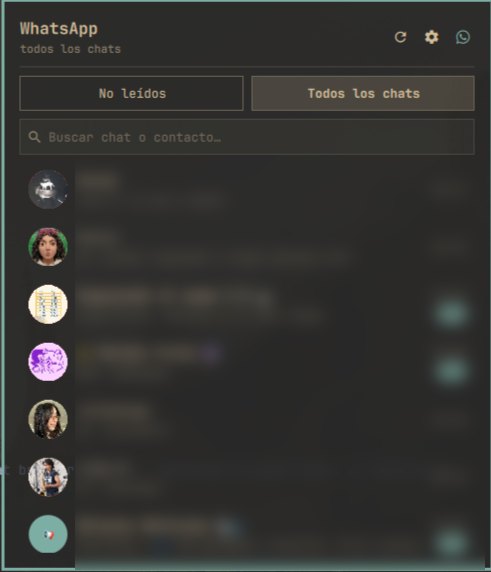
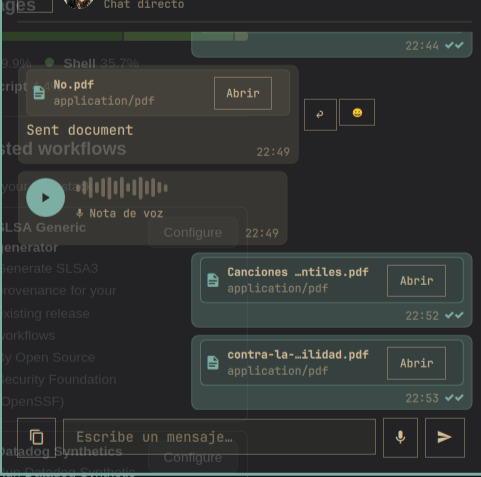

# Layitt WhatsMarchy Plus 💬

> Fast, native WhatsApp desktop panel and bar widget for [Omarchy Linux](https://omarchy.org).

<p align="center">
  
  
</p>

---

## ✨ Features

- 🔔 **Unread Notifications**: Live counts and sender indicators in the top bar.
- 💬 **All Chats Browser**: Search and browse all active and past conversations.
- ↩️ **Quotes & Replies**: WhatsApp quote banners and bubble previews.
- ❤️ **Emoji Reactions**: Hover emoji picker and real-time reaction badges.
- 🎙️ **Interactive Voice Notes**: Waveform player with seek/scrubbing and voice recording.
- 📎 **Media & Files**: Drag & drop sending and previews for photos, voice notes, and documents.
- ⚡ **Optimistic 0ms UI**: Instant message rendering with delivery checkmarks (`✓✓`).
- 🔒 **Privacy-First**: Read-only local SQLite connection; zero credential leaks.

---

## 🚀 Quick Start

### 1. Install & Link `wacli`
```bash
VER=0.17.1
curl -sL "https://github.com/openclaw/wacli/releases/download/v$VER/wacli_${VER}_linux_amd64.tar.gz" | tar -xz -C /tmp
install -Dm755 /tmp/wacli ~/.local/bin/wacli
wacli auth
```

### 2. Enable Sync Service
```bash
mkdir -p ~/.config/systemd/user
cp contrib/whatsmarchy-sync.service ~/.config/systemd/user/
systemctl --user daemon-reload
systemctl --user enable --now whatsmarchy-sync
```

### 3. Install Plugin
```bash
omarchy plugin add https://github.com/Layitt/whatsmarchy --enable
```

---

## ⚙️ Settings

Click the gear icon (⚙️) in the panel header to customize:
- **Notification Mode**: *All chats*, *Do Not Disturb (Paused)*, or a *Custom allow-list*.
- **Bar Detail Mode**: *Icon only*, *Count only*, *Sender and count*, or *Message preview*.

---

## 📜 Credits & Attribution

WhatsMarchy is an enhanced fork combining foundations from:
- [**`boyoyooo/whatsmarchy`**](https://github.com/boyoyooo/whatsmarchy) by **@boyoyooo** (Original widget & concept)
- [**`ricky/whatsapp`**](https://github.com/ricky/whatsapp) by **@ricky** (All-chats browsing concepts)
- [**`wacli`**](https://github.com/openclaw/wacli) by **@openclaw** (WhatsApp multi-device client engine)

---

## 📄 License

MIT License — see [LICENSE](LICENSE). Not affiliated with WhatsApp or Meta.
