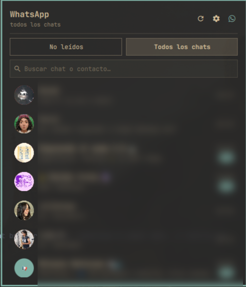

# WhatsMarchy

WhatsApp in your [Omarchy](https://omarchy.org) bar & desktop shell.

WhatsMarchy provides a rich, responsive desktop interface for WhatsApp powered by [`wacli`](https://github.com/openclaw/wacli). By default, the bar displays unread senders and message counts with zero distraction. Click to expand a complete WhatsApp conversation hub with instant replies, emoji reactions, voice note recording & playback, media attachment previews, in-chat search, and full chat list navigation.



---

## ✨ Features

- 🔔 **Bar Notifications**: Unread senders and counts directly in your top bar.
- 💬 **Full Chat Browser & Search**: Access all your chats (unread and archived/past conversations) with live instant search.
- ↩️ **Quotes & Replies**: Reply directly to specific messages with rich WhatsApp quote banners and speech bubble previews.
- ❤️ **Emoji Reactions**: React to messages with quick emoji picker on hover and see live reaction badges.
- 🎙️ **Interactive Voice Notes**:
  - Record voice replies with audio level preview.
  - Listen back to incoming and recorded voice notes directly in the panel.
  - Native playback with **interactive waveform scrubbing**, **play/pause**, and live timers.
- ⚡ **Optimistic 0 ms UI**: Messages and reactions appear immediately on send without interface lag.
- ✓✓ **Delivery & Read Ticks**: See sent (`🕒`) and delivered/read (`✓✓`) status ticks next to timestamps.
- ✍️ **Typing Presence**: Broadcasts typing and recording presence to WhatsApp when composing messages.
- 📎 **Media & File Attachments**: Drag-and-drop or select files/images to send with captions. Click photos, audio, videos, or documents to preview or open in your default app.
- 👤 **Circular Profile Avatars**: Renders circular contact and group profile pictures, auto-synced in the background.
- 🔒 **Privacy & Local Security**: Read-only SQLite mirror connection; contacts and messages are never exposed in process argv.

---

## 🛠️ How it works

WhatsMarchy does not talk to WhatsApp servers directly. It connects to [**`wacli`**](https://github.com/openclaw/wacli), a lightweight open-source tool that links as a companion device (multi-device) and maintains a local SQLite database mirror on your machine.

```
Phone ──► WhatsApp Multi-Device ──► wacli sync ──► local SQLite database
                                                           │
                                                           ▼
                                                  WhatsMarchy bar widget
```

---

## 🚀 Installation

### 1. Install and pair `wacli`

Download the latest release of `wacli` and link your WhatsApp account by scanning the terminal QR code:

```bash
VER=0.17.1   # check https://github.com/openclaw/wacli/releases for the latest
cd "$(mktemp -d)"
curl -fLO "https://github.com/openclaw/wacli/releases/download/v$VER/wacli_${VER}_linux_amd64.tar.gz"
curl -fLO "https://github.com/openclaw/wacli/releases/download/v$VER/checksums.txt"
sha256sum -c --ignore-missing checksums.txt
tar xzf "wacli_${VER}_linux_amd64.tar.gz"
install -Dm755 wacli ~/.local/bin/wacli

# Link your WhatsApp (scan QR code with WhatsApp on your phone)
wacli auth
```

### 2. Enable the background sync service

```bash
mkdir -p ~/.config/systemd/user
cp contrib/whatsmarchy-sync.service ~/.config/systemd/user/
systemctl --user daemon-reload
systemctl --user enable --now whatsmarchy-sync
```

### 3. Install the WhatsMarchy plugin

```bash
omarchy plugin add https://github.com/Layitt/whatsmarchy --enable
```

---

## ⚙️ Settings

Open the panel and click the gear icon (⚙️) for:
- **Notification Mode**: *All chats*, *Paused (Do Not Disturb)*, or a *Custom allow-list*.
- **Bar Detail Mode**: *Icon only*, *Count only*, *Sender and count* (default), or *Message preview*.
- **Sync & Audio Settings**: Configurable refresh intervals and media thresholds.

---

## 🗑️ Uninstall

```bash
omarchy plugin remove layitt.whatsmarchy
rm -rf ~/.config/omarchy/whatsmarchy ~/.cache/omarchy-whatsmarchy
systemctl --user disable --now whatsmarchy-sync
rm -f ~/.config/systemd/user/whatsmarchy-sync.service
```

---

## 📜 Credits & Attribution

WhatsMarchy is an enhanced evolution and fork combining the best concepts and foundations from:
- [**`boyoyooo/whatsmarchy`**](https://github.com/boyoyooo/whatsmarchy) by **@boyoyooo** — The original privacy-first WhatsApp notification and bar widget for Omarchy.
- [**`ricky/whatsapp`**](https://github.com/ricky/whatsapp) by **@ricky** — The full chat exploration and conversation browsing concepts.
- [**`wacli`**](https://github.com/openclaw/wacli) by **@openclaw** — The underlying WhatsApp multi-device command-line client and sync engine.

---

## 📄 License

MIT License — see [LICENSE](LICENSE).

Not affiliated with, endorsed by, or connected to WhatsApp or Meta.
